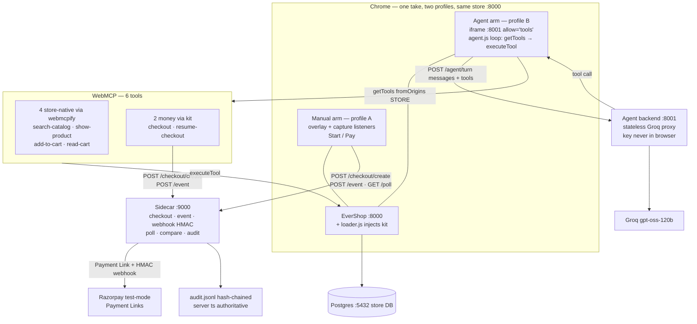

<h1 align="center">WebMCP for Razorpay</h1>

<p align="center">
  
  
  
  
  
  
  
  
</p>

<p align="center"><em>"Compressing discovery-to-order lifts total spend +28.5% and purchase frequency +43%"</em></p>

This is what WebMCP implementations could achieve in any and every web-shop. Use in-shop agents, to compress discovery-to-order time.

W3C WebMCP turns any webshop's own features (search, filter, cart) into agent tools via webmcpify; our kit adds the money layer (`checkout`, `resume-checkout`) and Razorpay test-mode Payment Links settle it — raced live, agent vs manual, on the same EverShop catalog. Spec: [`docs/spec.md`](docs/spec.md).

## Architecture



## Local Setup

1. Initial dependencies and store setup

```
cp .env.example .env  # Fill with Razorpay **test** keys + Groq key
make db               # postgres container
make setup            # deps (store npm + uv sync) + .env
make seed             # grocery catalog (47 products, INR, image-first)
```

2. Launch Store server

```
make store            # store on :8000
```

3. Spin up agent

```
make dev              # sidecar :9000 + agent :8001
```

## Store credits (GPL-3.0)

Store is [EverShop](https://github.com/evershopcommerce/evershop) v2.2.1 (commit `79ee0d0`), © The Nguyen / EverShop contributors, GPL-3.0 — see [`store/LICENSE`](store/LICENSE) and [`store/CREDITS.md`](store/CREDITS.md). 

Product photos: [Unsplash](https://unsplash.com) (Unsplash License), URLs listed in `store/CREDITS.md`.